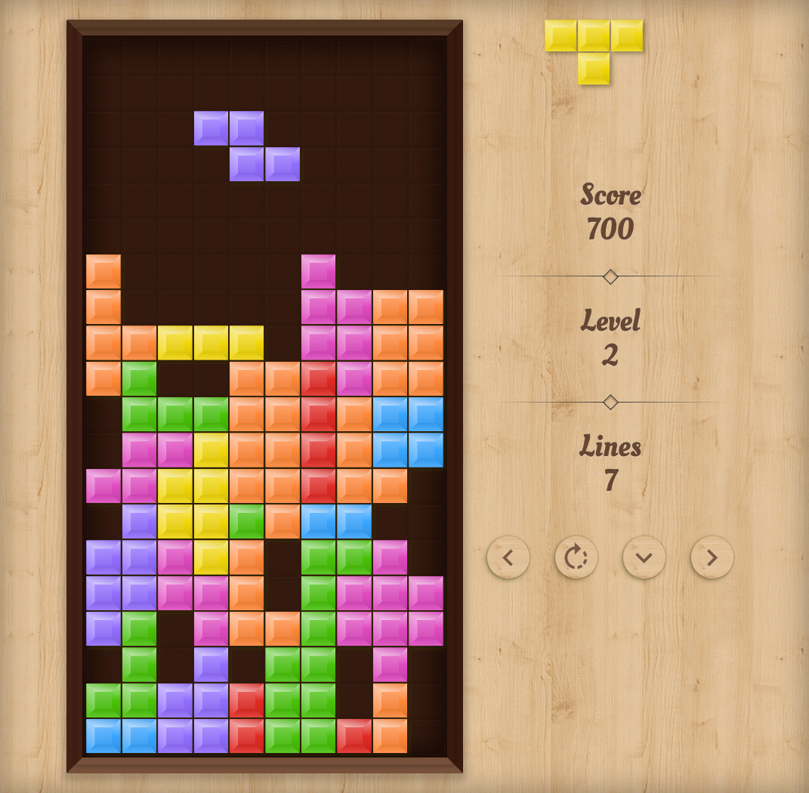

# Blocchi puzzle

A tetromino game based on React, Redux, TypeScript, and functional programming

🚀 Play the game: https://gibbok.github.io/blocchi-puzzle/game/

👨‍💻 UI components: https://gibbok.github.io/blocchi-puzzle/storybook/

## Introduction

Recently I took some time to work through the remaking of a classic tetromino game as a side project, although the game logic is fairly straightforward, I wanted to implement it using a professional approach and most modern front-end technologies and techniques.

## Technology overview

The game is built in [TypeScript](https://www.typescriptlang.org/), using functional programming techniques with [fp-ts](https://github.com/gcanti/fp-ts).

UI components are written in [React](https://reactjs.org/) in isolation using [Storybook](https://storybook.js.org/).
Application state management is handled using [Redux](https://redux.js.org/) with middleware [redux-thunk](https://github.com/reduxjs/redux-thunk).
The layout is fluid and responsive based on CSS3 written using [styled-components](https://styled-components.com/).

Animations created using [GSAP](https://greensock.com/gsap/) and [react-transition-group](https://github.com/reactjs/react-transition-group) with CSS transitions.

All tests are written using [Jest](https://jestjs.io/) and [Sinon](https://sinonjs.org/) with coverage to near 100%. UI snapshots and behavioral testing is performed using [react-test-renderer](https://reactjs.org/docs/test-renderer.html). To mock the store [redux-mock-store](https://github.com/reduxjs/redux-mock-store) was used.

Additional visual regression testing is setup using [Loki](https://loki.js.org/). End-to-end testing made with [Cypress](https://www.cypress.io/). Continuous integration with [Travis Ci](https://travis-ci.com/).

## Screenshot

